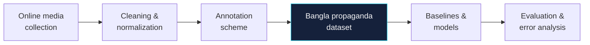
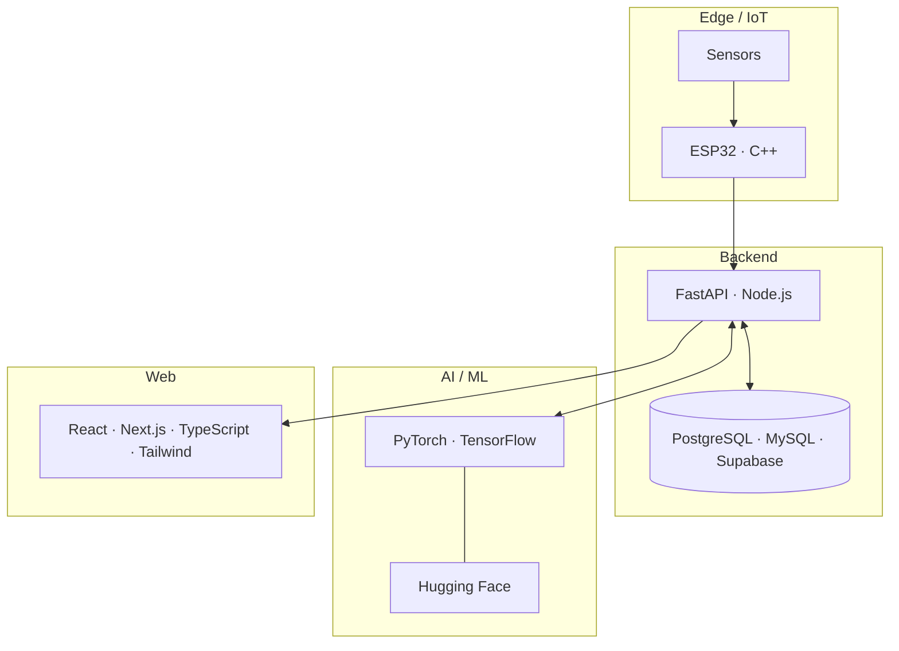

<!--
  Setup:
  The contribution snake needs the Platane/snk GitHub Action (.github/workflows/snake.yml) in this repo.
-->

<div align="center">


</div>

<br/>

```python
# about.py

class Omor:
    university  = "United International University (UIU), Dhaka"
    degree      = "B.Sc. in CSE  |  graduating 2027"

    research    = ["Low-resource Bangla NLP", "Propaganda detection", "Dataset construction"]
    engineering = ["Full-stack web", "IoT / ESP32", "DevOps", "Football analytics"]

    principle   = "Messy real-world data -> systems that actually work"

    def open_to(self):
        return ["research collaboration", "NLP / AI projects", "embedded + IoT builds"]
```

<div align="center">

</div>

## 🧬 Research: Propaganda Detection in Bangla

Bangla has hundreds of millions of speakers but very few resources for studying coordinated manipulation online. I am working with a team to ask a simple question: **can coordinated propaganda be detected in a low-resource language?**



**Current stage:** literature mapping. Existing datasets, preprocessing methods, and evaluation protocols are being reviewed before the research direction is locked.

<div align="center">

</div>

## ⚙️ Systems I Build

| | Project | What it does | Stack | State |
|:-:|---|---|---|:-:|
| ☀️ | **HelioSense** | Real-time smart solar panel monitoring | ESP32 · C++ · Sensors | 🟠 building |
| 🌊 | **Local Flood Management System** | Environmental monitoring + early flood-warning prototype | ESP32 · C++ · Sensors | 🟢 done |
| 🛍️ | **KaajerBazar** | Micro-project marketplace for Bangladeshi students, with AI-assisted bid matching | Next.js · Tailwind · Claude API · Supabase | 🟢 done |
| 🩺 | **MediSheba BD** | Healthcare platform with live queue tracking for patients and doctors | React · TypeScript · Node.js · MySQL | 🟢 done |
| 📄 | **JavaFX Resume Generator** | Desktop resume builder built around OOP design principles | Java · JavaFX | 🟢 done |
| 🔎 | **Bangla Propaganda Detection** | Research on coordinated propaganda in low-resource Bangla | NLP · Dataset construction | 🟠 research |

<div align="center">

</div>

## 🏗️ How My Stack Fits Together



<details>
<summary><b>🔧 Full toolbox (click to expand)</b></summary>

<br/>

**Languages**
<br/>


**AI / ML**
<br/>


**Web & Backend**
<br/>


**Data**
<br/>


**Embedded & Tools**
<br/>


</details>

<div align="center">

</div>

## 📡 Live Status

```yaml
now:
  researching: Bangla propaganda datasets & detection methods
  building:    HelioSense (ESP32 solar monitoring)
  learning:    advanced NLP, low-resource language processing, DevOps
next:
  goal:        publish research on low-resource Bangla NLP
  open_to:     collaboration on AI/ML, NLP, embedded systems
```

## 📊 Activity

<div align="center">


<br/><br/>


</div>

<div align="center">

</div>

## 🔌 Connect

<div align="center">

[](https://github.com/omorfarukullas)
[](https://www.linkedin.com/in/omorullas/)
[](https://x.com/berlinsergio34)
[](mailto:omor.farukh16@gmail.com)
[](https://www.kaggle.com/omorfaruk16)
[](https://omorfarukullas.vercel.app/)

<br/>


</div>
