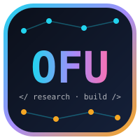

# OMOR FARUCK ULLAS

**Author:** [@omorfarukullas](https://github.com/omorfarukullas)

Department of CSE, United International University (UIU), Dhaka, Bangladesh · Expected graduation: 2027

`living draft` · continuously revised · [portfolio](https://omorfarukullas.vercel.app/)

 

**Figure 1.** Messy data stream. The input I try to turn into working systems.

> ### 🧾 Abstract
> I am an undergraduate who works where **messy real-world data** meets **working software**. My main research question is whether **coordinated propaganda can be detected in Bangla**, a language with hundreds of millions of speakers but few NLP resources. Beside research, I build full-stack web platforms and real-time IoT systems on ESP32. This page is a living summary of that work.

**🔑 Keywords:**      

## 1. Introduction

Most NLP progress is measured in English. For Bangla, even basic questions are still open: *Where is the data? Who labelled it? Does it reflect real online media?*

My view is simple:

$$\max_{\theta}\ \mathbb{E}_{x \sim \text{messy world}}\big[\ \text{usefulness}(f_\theta(x))\ \big]$$

A model that only works on a clean benchmark is not the goal. A system that works on real, noisy input is the goal.[^1]

[^1]: Same idea for hardware. A sensor that works only on my desk is not a product.

## 2. Methods

 

**Figure 2.** The tools I use most.

| Layer | Tools | Used for |
|:--|:--|:--|
| 🧠 Research & ML | Python · PyTorch · TensorFlow · Hugging Face | Models, datasets, evaluation |
| ⚙️ Backend | FastAPI · Node.js · PostgreSQL · MySQL · Supabase | APIs and data storage |
| 🎨 Frontend | React · Next.js · TypeScript · Tailwind CSS | Interfaces |
| 📡 Embedded | ESP32 · C/C++ · Raspberry Pi | Sensors and real-time monitoring |
| 🧰 Core | Java · JavaScript · Git · GitHub | Everything else |

**Table 1.** Methods used across my work.

## 3. Experiments

| # | Experiment | Stack | State |
|:-:|---|---|:-:|
| E1 | 🔎 **Bangla Propaganda Detection**: can coordinated propaganda be found in Bangla online media? Building a dataset and comparing detection methods. Now reading the literature. | NLP · Dataset construction |  |
| E2 | ☀️ **HelioSense**: real-time smart solar panel monitoring | ESP32 · C++ · Sensors |  |
| E3 | 🌊 **Local Flood Management System**: environmental monitoring with early flood warning | ESP32 · C++ · Sensors |  |
| E4 | 🛍️ **KaajerBazar**: micro-project marketplace for Bangladeshi students, with AI-assisted bid matching | Next.js · Tailwind · Claude API · Supabase |  |
| E5 | 🩺 **MediSheba BD**: healthcare platform with live queue tracking | React · TypeScript · Node.js · MySQL |  |
| E6 | 📄 **JavaFX Resume Generator**: desktop resume builder, OOP design | Java · JavaFX |  |

**Table 2.** Six experiments. Two are still running.

## 4. Results

**Figure 3.** GitHub statistics (left) and most used languages (right).

  

**Figure 4.** Contribution activity over time.

  

**Figure 5.** The same data, but a snake eats it.

| Metric | Value |
|:--|:-:|
| Experiments completed | 4 / 6 |
| Languages in daily use | Python, C++, Java, TypeScript |
| Hardware platforms | ESP32, Raspberry Pi |
| Main research language | Bangla |

**Table 3.** Honest summary. Research results will be added when they exist.

## 5. Future Work

- [ ] Lock the research direction for Bangla propaganda detection
- [ ] Release a Bangla propaganda dataset with a clear annotation guide
- [ ] Finish HelioSense and test it with real solar panel data
- [ ] Go deeper into NLP, low-resource methods, and DevOps
- [ ] Write the research up properly

> **Open to:** research collaboration · AI/ML and NLP projects · embedded and IoT builds

## References & Contact

 

Revision log: v0.x, updated whenever the work changes.

